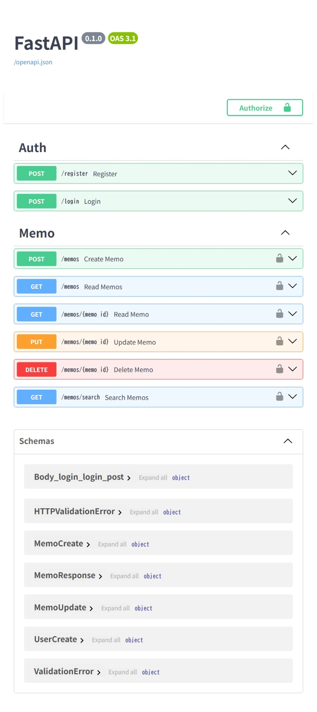

# メモ管理API（FastAPI）


## 1. 概要
FastAPIを使用して作成したメモ管理APIです。
ユーザー登録・認証（JWT）・メモのCRUD機能を実装しています。

バックエンド開発の学習およびポートフォリオとして作成しました。


## 2. 機能

- ユーザー登録
- ログイン（JWT認証）
- メモのCRUD操作
- メモ検索機能
- ページネーション
- ソート機能
- ユーザーごとのデータ分離
- パスワードのハッシュ化（bcrypt）
- バリデーション
- created_at / updated_at 管理


## 3. 技術スタック

- FastAPI
- SQLite
- SQLAlchemy
- JWT認証
- passlib（bcrypt）
- Docker / docker-compose


## 4. ディレクトリ構成

```
memo_api/
├── app/
│   ├── main.py        # エントリーポイント
│   ├── models.py      # DBモデル
│   ├── schemas.py     # バリデーション
│   ├── crud.py        # DB操作
│   ├── auth.py        # 認証・JWT処理
│   └── database.py    # DB接続
├── data/              # SQLiteデータ（gitignore対象）
├── docker-compose.yml
├── Dockerfile
├── requirements.txt
└── README.md
```


## 5. API例

### ログイン

```
POST /login

request:
{
  "username": "test",
  "password": "test123"
}

response:
{
  "access_token": "xxxxx",
  "token_type": "bearer"
}

※ 取得したaccess_tokenをAuthorizationヘッダーに設定してAPIを利用します。
```


## 6. API使用例

### メモ一覧取得

GET /memos?page=1&limit=10&sort=-created_at


## 7. 実行方法

### 環境変数

.envファイルを作成し、以下を設定してください。

SECRET_KEY=your_secret_key

### Dockerで起動

docker-compose up --build

### APIドキュメント

http://localhost:8000/docs


## 8. APIドキュメント画面




## 9. 工夫した点

- JWT認証を導入し認証付きAPIを実装
- パスワードをハッシュ化してセキュリティを強化
- ユーザーごとにメモを分離し、他ユーザーのデータにアクセスできない設計にした
- バリデーションにより不正入力を防止
- ページネーション・ソート機能を実装し実務的なAPIにした
- updated_atを追加し更新履歴を管理


## 10. 今後の改善

- PostgreSQL対応
- ページネーションの最適化（total countなど）
- テストコード追加